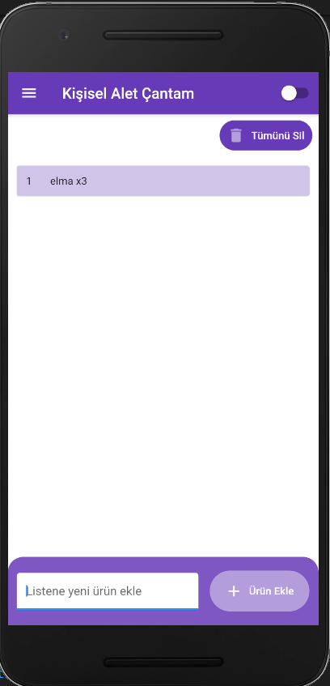

# MyToolBox

Toolbox project was developed with flutter for mobile programming course.

## Tools And Features
- Todo or Shopping Cart, you can create list, add item, delete item lists.
- View and zoom with the hes codes gallery
- Compass
- Calculator
- Sqflite and data model

## User Interface

{:height="250px" width="250px"}.
{:height="100px" width="100px"}.

